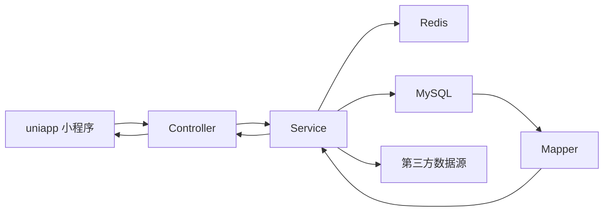
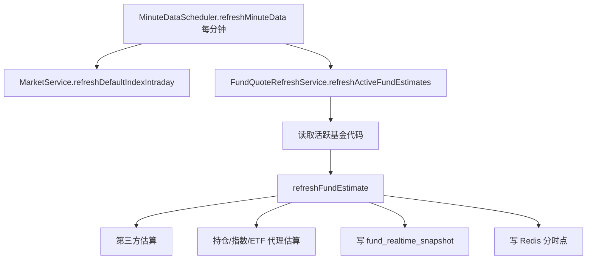
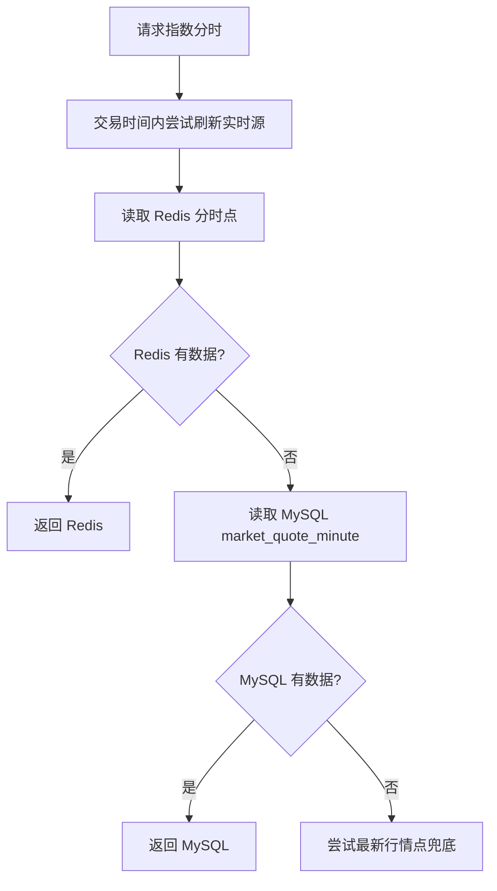

# JJKK_2 后端功能实现说明

本文档说明 `JJKK_2` Spring Boot 后端的分层结构、主要功能、数据流、缓存策略、定时任务和后续扩展方式。当前后端已经按 `controller / service / mapper / dto` 的结构整理，前端 `JK_1` 只需要通过 HTTP 和 WebSocket 调用后端接口，不直接访问第三方行情源。

## 1. 项目分层

后端主包为 `com.wdh.jjkk_2`，核心目录如下：

| 目录 | 作用 |
| --- | --- |
| `controller` | HTTP 接口层，只处理参数、鉴权入口、统一响应，不写复杂业务 |
| `service` | 业务层，负责基金搜索、估值、行情、资讯、用户、自选、Redis 缓存和持久化 |
| `mapper` | JDBC `RowMapper` 映射层，把 SQL 查询结果转换成 DTO |
| `dto` | 请求和响应对象，接口出入参都放在这里 |
| `realtime` | WebSocket 和定时任务 |
| `common` | 统一返回、分页、业务异常、全局异常处理、静态资源映射 |
| `resources/db` | 数据库结构 SQL |

整体调用链：



## 2. 统一返回和异常

所有接口统一返回 `ApiResponse<T>`：

```json
{
  "success": true,
  "message": "OK",
  "data": {}
}
```

业务异常通过 `BusinessException` 抛出，由 `GlobalExceptionHandler` 统一转换成 HTTP 状态码和 JSON 响应。这样 controller 不需要重复写 `try/catch`。

## 3. 用户登录和用户信息

相关文件：

- `controller/AuthController.java`
- `service/AuthService.java`
- `controller/UserFundController.java`
- `service/UserFundService.java`
- `service/UserAvatarStorageService.java`
- `dto/AuthDtos.java`
- `dto/UserDtos.java`

### 3.1 微信登录

接口：`POST /api/auth/wechat-login`

实现流程：

1. 前端调用 `uni.login` 拿到微信 `code`。
2. 后端 `AuthService` 调用微信 `jscode2session` 接口换取 `openid` 和 `unionid`。
3. `UserFundService.createOrUpdateUser` 根据 `openid` 写入或更新 `app_user`。
4. 后端生成随机 token，并把 `AuthSession` 写入 Redis。
5. 前端后续请求通过 `Authorization: Bearer <token>` 传入。

Redis token key：

```text
jjkk:auth:token:{token}
```

默认有效期由 `jjkk.auth.token-ttl-days` 控制。

### 3.2 用户资料

接口：

- `GET /api/users/{userId}`
- `PUT /api/users/{userId}/profile`
- `POST /api/users/{userId}/avatar`

实现方式：

- 用户昵称、头像、注册时间保存在 `app_user`。
- 对外展示的用户 ID 是 9 位数字：`100000000 + app_user.id`。
- 上传头像时，后端把文件保存到 `uploads/avatar`，再通过静态资源路径 `/uploads/**` 暴露给前端。

## 4. 自选基金

相关文件：

- `controller/UserFundController.java`
- `service/UserFundService.java`
- `mapper/UserFundRowMapper.java`
- `dto/UserDtos.java`

接口：

- `GET /api/users/{userId}/watchlist`
- `POST /api/users/{userId}/watchlist`
- `PUT /api/users/{userId}/watchlist/{watchId}`
- `PUT /api/users/{userId}/watchlist/order`
- `DELETE /api/users/{userId}/watchlist/{watchId}`

实现流程：

1. 每个接口先通过 `AuthService.requireUser` 校验 token 中的用户 ID 和路径中的 `userId` 是否一致。
2. 新增自选前，后端检查 `fund_share_class` 中是否存在该基金。
3. 自选数据写入 `user_watchlist`。
4. 新增自选后会尝试立即调用 `FundQuoteRefreshService.refreshFundEstimate`，让前端尽快看到估算数据。
5. 列表查询会联表读取最新净值 `fund_nav_daily` 和估算快照 `fund_realtime_snapshot`。

用户隔离依靠 `user_id` 字段和 token 校验保证。用户只能访问自己的自选列表。

## 5. 官方基金搜索和基金基础信息

相关文件：

- `controller/FundController.java`
- `service/OfficialFundImportService.java`
- `service/FundService.java`
- `mapper/FundRowMapper.java`
- `dto/FundDtos.java`
- `dto/OfficialFundDtos.java`

### 5.1 官方搜索

接口：`GET /api/funds/official/search?keyword=021894&limit=30`

实现流程：

1. `OfficialFundImportService` 调用东方财富基金搜索接口。
2. 解析返回的基金代码、基金名称、类型等基础字段。
3. 用 `upsert` 方式写入 `fund_product` 和 `fund_share_class`。
4. 返回搜索结果，前端可直接展示并添加自选。

设计目的：用户不用手工录入基金，基金基础信息来自公开数据源。

### 5.2 基金查询

接口：

- `GET /api/funds`
- `GET /api/funds/{fundCode}`
- `GET /api/funds/{fundCode}/minute`
- `GET /api/funds/{fundCode}/history?range=1m|3m|6m|1y`

实现方式：

- `FundService.search` 从本地基金表查询基金。
- `FundService.getByCode` 查询基金详情前，会同步最近净值并校正已收盘数据。
- `FundService.minuteSeries` 优先读取 Redis 中的当日分时点；Redis 没有时读取 MySQL；如果仍没有，则尝试使用最新快照补一个点。
- `FundService.historySeries` 按 `range` 计算日期范围，再同步东方财富净值历史，最后返回每日净值/涨跌幅点。

## 6. 基金估值计算

相关文件：

- `service/FundQuoteRefreshService.java`
- `service/IntradayRedisCacheService.java`
- `service/FundService.java`

基金估值由两层数据组成：

1. 第三方估算：东方财富 `fundgz` 返回估算净值和估算涨幅。
2. 本地持仓估算：根据基金公开持仓、资产配置、目标 ETF 或指数代理，结合实时行情计算更稳定的估值。

### 6.1 每分钟估值

定时任务调用链：



每分钟点的固定规则：

- A 股基金按交易日 `09:30-11:30`、`13:00-15:00` 生成点。
- `normalizeMinuteQuoteTime` 会把数据时间规整到分钟。
- 未到的分钟不补假数据，前端可以按固定 X 轴留空。
- 收盘后如果拿到官方净值，会通过 `reconcileClosedTradingDay` 修正最后一个分时点。

### 6.2 收盘校正

每天 `19:00-23:00` 每半小时执行一次，第二天 `00:05` 再补一次：

- 查询未更新真实净值的基金。
- 从东方财富同步净值历史。
- 用官方净值计算真实涨幅。
- 更新 `fund_realtime_snapshot` 和 `fund_estimate_minute` 最后点。

这样前端在未获取官方真实涨幅时显示“估值/未更新”，拿到官方净值后显示“真实涨幅/已更新”。

## 7. 大盘行情

相关文件：

- `controller/MarketController.java`
- `service/MarketService.java`
- `dto/MarketDtos.java`

接口：

- `GET /api/market/overview`
- `GET /api/market/indices/{symbol}/minute`
- `GET /api/market/indices/{symbol}/history?range=1m|3m|6m|1y`
- `GET /api/market/fund-breadth`
- `GET /api/market/fund-rankings`
- `GET /api/market/sector-rankings`

### 7.1 默认指数

当前默认覆盖：

- A 股：上证指数、深证成指、创业板指、沪深 300、中证 500、科创 50
- 港股：恒生指数、恒生国企、恒生科技
- 美股：道琼斯、标普 500、纳斯达克 100
- 黄金：沪金主连、伦敦金现

美元指数在代码里过滤掉，不对前端返回。

### 7.2 数据源优先级

行情实时数据按可用性兜底：

1. 东方财富指数/期货接口
2. 新浪行情接口
3. 腾讯 A 股接口
4. Yahoo 图表接口
5. MySQL 历史缓存

分时图流程：



历史走势优先用东方财富 K 线，拿不到时使用新浪或 Yahoo 日 K，最后回落到 MySQL 已存数据。

## 8. Redis 分时缓存和 MySQL 持久化

相关文件：

- `service/IntradayRedisCacheService.java`
- `realtime/MinuteDataScheduler.java`

Redis 主要保存当日浏览和计算出来的分时数据，避免每次打开详情都扫 MySQL。

主要 key：

| key | 说明 |
| --- | --- |
| `jjkk:intraday:fund:detail:{fundCode}` | 基金详情缓存 |
| `jjkk:intraday:fund:minute:{tradingDay}:{fundCode}` | 基金当日分时点，hash 结构 |
| `jjkk:intraday:fund:set:{tradingDay}` | 当日有缓存分时的基金集合 |
| `jjkk:intraday:fund:latest-day:{fundCode}` | 某只基金最新缓存交易日 |
| `jjkk:intraday:market:minute:{tradingDay}:{symbol}` | 指数当日分时点 |
| `jjkk:intraday:market:set:{tradingDay}` | 当日有缓存分时的大盘集合 |

TTL：`42` 小时。这样可以覆盖当日、晚上持久化以及第二天早上查看上一个交易日分时。

每天 `00:00` 执行：

1. 从 Redis 集合找出前一交易日的基金和指数。
2. 读取 hash 中的所有分钟点。
3. 写入 `fund_estimate_minute` 和 `market_quote_minute`。
4. `ON DUPLICATE KEY UPDATE` 保证重复执行不会产生重复数据。

## 9. 资讯板块

相关文件：

- `controller/InformationController.java`
- `service/InformationService.java`
- `dto/InformationDtos.java`

接口：

- `GET /api/information?page=1&size=6&importantOnly=false`
- `GET /api/information/{id}`

实现方式：

1. `InformationService` 定时调用东方财富快讯接口。
2. 解析标题、摘要、正文、图片、图表、相关代码、发布时间。
3. 根据关键词判断是否为重要资讯。
4. 数据写入 `information_item`。
5. 每次列表只返回分页数据，前端实现懒加载。
6. 定时清理 3 天前的数据。

重要关键词包括基金、ETF、港股、美股、黄金、债券、利率、降息、加息、央行、政策、风险、暴涨、暴跌、清盘、限购、申购、赎回、监管、重要、突发等。

## 10. 建议反馈

相关文件：

- `controller/FeedbackController.java`
- `service/FeedbackService.java`
- `dto/FeedbackDtos.java`

接口：`POST /api/feedback`

实现方式：

- 前端传入反馈内容、分类、联系方式、设备信息。
- 后端校验登录态。
- 反馈以 JSON 行写入本地日志文件：`logs/feedback/feedback-{date}.log`。
- 日志包含用户 ID、9 位展示 ID、提交时间、内容、联系方式和设备信息。

## 11. WebSocket

相关文件：

- `realtime/RealtimeWebSocketConfig.java`
- `realtime/FundRealtimeWebSocketHandler.java`

地址：`/api/ws/funds`

实现方式：

- 前端建立长连接。
- 发送 `SUBSCRIBE` 消息订阅基金。
- 后端立即返回确认消息。
- 当前主要用于保持实时通道，后续可把每分钟刷新后的基金估值主动推送给在线用户。

## 12. 定时任务

相关文件：`realtime/MinuteDataScheduler.java`

| 时间 | 任务 | 说明 |
| --- | --- | --- |
| 每个交易日 9-15 点每分钟 | `refreshMinuteData` | 刷新大盘分时和活跃基金估值 |
| 每个交易日 8:00 | `clearTodayMinuteData` | 清理当天旧分时，为开盘准备 |
| 每个交易日 19:00-23:00 每半小时 | `reconcileClosedFundMinutes` | 收盘后用官方净值校正基金最后点 |
| 周二到周六 00:05 | `reconcileLateClosedFundMinutes` | 兜底校正上一交易日 |
| 每天 00:00 | `persistRedisIntradayData` | Redis 分时数据落 MySQL |
| 每 10 分钟 | `refreshInformation` | 刷新资讯 |
| 每天 00:20 | `cleanupInformation` | 删除 3 天前资讯 |

## 13. 数据库设计要点

数据库结构在 `src/main/resources/db/schema.sql`。

核心表：

| 表 | 作用 |
| --- | --- |
| `data_source` | 数据源登记，记录来源、优先级、许可状态 |
| `fund_product` | 基金主产品信息 |
| `fund_share_class` | 基金份额代码信息 |
| `fund_nav_daily` | 每日官方净值 |
| `fund_realtime_snapshot` | 基金最新估值/真实涨幅快照 |
| `fund_estimate_minute` | 基金每分钟估值点 |
| `security_instrument` | 指数、股票、期货等行情标的 |
| `market_quote_latest` | 大盘/标的最新行情 |
| `market_quote_minute` | 大盘/标的分钟行情 |
| `fund_position_disclosure` | 基金公开重仓股 |
| `fund_asset_allocation` | 基金资产配置 |
| `fund_sector` / `fund_sector_member` | 基金所属板块 |
| `information_item` | 资讯 |
| `app_user` | 用户 |
| `user_watchlist` | 自选基金 |
| `user_fund_holding` | 持有基金，当前前端暂不使用但后端保留 |

## 14. 部署配置

主要配置在 `application.yml`：

```yaml
spring:
  datasource:
    url: ${JJKK_DB_URL:jdbc:mysql://localhost:3306/fund_quick_look_jk?...}
    username: ${JJKK_DB_USERNAME:root}
    password: ${JJKK_DB_PASSWORD:}
  data:
    redis:
      host: ${JJKK_REDIS_HOST:localhost}
      port: ${JJKK_REDIS_PORT:6379}

server:
  port: ${JJKK_SERVER_PORT:8080}
  servlet:
    context-path: /api
```

上线时建议通过环境变量设置数据库、Redis、微信配置：

```text
JJKK_DB_URL
JJKK_DB_USERNAME
JJKK_DB_PASSWORD
JJKK_REDIS_HOST
JJKK_REDIS_PORT
JJKK_REDIS_PASSWORD
JJKK_SERVER_PORT
JJKK_WECHAT_APP_ID
JJKK_WECHAT_APP_SECRET
```

## 15. 后续扩展建议

1. 把第三方数据源访问抽成独立 `source` 包，便于管理东方财富、新浪、腾讯、Yahoo 的限流和熔断。
2. 给基金估值模型增加版本号，支持对比不同算法的准确率。
3. 将 WebSocket 推送做成用户订阅表，只推送用户自选基金，减少 2 核 2G 服务器压力。
4. 为资讯增加去重指纹，避免不同源重复快讯。
5. 增加管理端接口，用于查看数据源健康度、失败次数、最后成功时间。
6. 增加 Prometheus/日志指标：第三方请求耗时、失败率、Redis 命中率、估值覆盖率。

