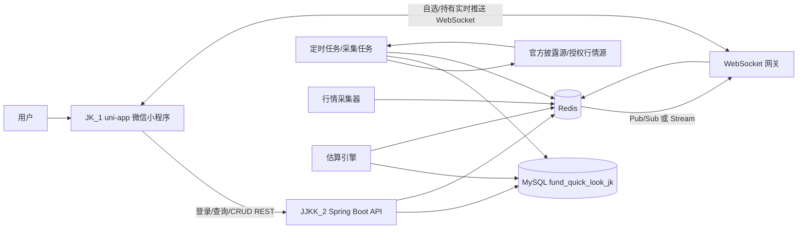
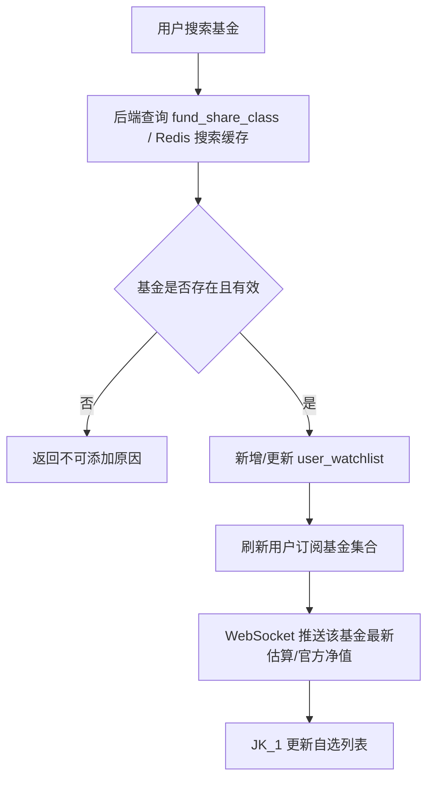
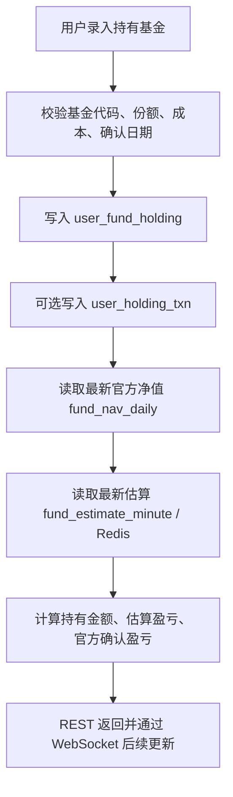
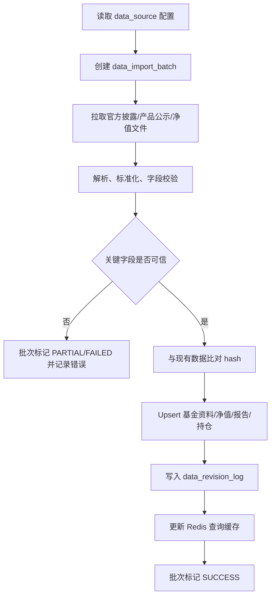
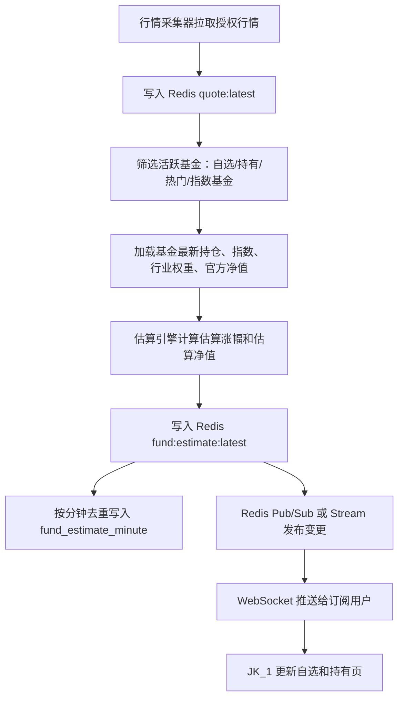

# 基金快看设计草案

项目拆分：

- `JK_1`：uni-app 微信小程序前端。
- `JJKK_2`：Spring Boot 后端。
- 数据库：MySQL 8，建议库名 `fund_quick_look_jk`。
- 缓存与推送：Redis + WebSocket。

## 关键边界

场外基金的官方净值不是盘中实时数据。官方可验证的数据主要是基金合同、招募说明书、产品资料概要、定期报告、每日净值等公开披露信息；开放式基金通常在每个开放日后披露基金份额净值和累计净值。盘中涨跌只能做“估算”，不能当作官方净值展示。

因此系统里必须把数据分成两类：

- 官方披露数据：基金资料、基金公司、托管人、每日净值、季度/中期/年度报告、持仓披露等。要求可追溯到数据源、导入批次和更新时间。
- 盘中估算数据：基于最新披露持仓、跟踪指数、行业权重、市场行情、汇率等推算。页面上必须标记“估算”、更新时间、数据延迟和置信度。

## 数据真实性策略

1. 官方数据优先：基金基础信息、净值和报告以基金管理人网站、基金托管人网站、中国证监会基金电子披露网站、中国证券投资基金业协会产品公示等为优先来源。
2. 行情数据合规：股票、指数、ETF、期货、汇率等实时行情建议使用有授权的行情服务商；第三方免费接口只能做开发期或降级兜底，不能承诺生产真实性。
3. 全链路留痕：所有核心表保留 `source_id`、`source_url`、`source_updated_at`、`import_batch_id`；重要变更进入 `data_revision_log`。
4. 估算不覆盖官方：分钟估算写入 `fund_estimate_minute` 和 Redis，官方净值写入 `fund_nav_daily`，两者不互相覆盖。
5. 前端清晰提示：自选和持有页展示“估算涨幅”，等官方净值出来后再展示“确认涨幅/实际收益”。

参考依据：

- 中国证监会《公开募集证券投资基金信息披露管理办法》：https://www.csrc.gov.cn/csrc/c106256/c1653985/content.shtml
- 中国证券投资基金业协会“公募基金产品”公示页面：https://www.amac.org.cn/informationpublicity/productpublicity/informationPublicity/
- 中国证监会“公募基金产品索引（截至20260131）”：https://www.csrc.gov.cn/csrc/c101900/c1029655/content.shtml
- 中国证监会、人民银行《公开募集证券投资基金信息披露电子化规范》公告：https://www.csrc.gov.cn/csrc/c101954/c6987198/content.shtml

## 总体架构

## 核心业务模块

- 用户模块：微信登录、用户状态、最近登录时间。
- 基金资料模块：基金公司、托管人、基金产品、份额类别、基金经理、费率、交易状态。
- 自选基金：新增、删除、排序、备注、预警开关。
- 持有基金：新增、编辑、删除、交易流水、成本、份额、估算盈亏、官方确认盈亏。
- 官方净值：每日净值、累计净值、分红、申购/赎回状态。
- 持仓披露：基金定期报告、资产配置、行业配置、重仓证券。
- 实时行情：股票/指数/ETF/期货/汇率最新行情和分钟行情。
- 估算引擎：按基金类型选择模型，生成分钟级估算净值和估算涨幅。
- 排名和板块：预留每日排名、行业/主题/板块基金归属。
- 数据治理：数据源、导入批次、修订记录、人工审计。

## 自选基金流程

## 持有基金流程

## 官方数据导入流程

## 盘中估算流程

## 估算模型建议

- 指数基金：优先使用跟踪指数或对应 ETF 的实时涨跌，精度相对高。
- 股票型/混合型基金：使用最新披露重仓股、行业配置、业绩比较基准估算；由于持仓披露滞后，置信度要降低。
- QDII：需要处理海外市场交易时间、汇率、节假日，建议单独模型。
- 债券/货币基金：盘中估算意义较弱，可展示最近官方万份收益、七日年化、债券指数参考，不建议强行给实时涨幅。
- FOF/REIT/商品基金：按底层基金、REIT 或商品/期货价格建专门模型。

## Redis 设计

- `fund:basic:{fundCode}`：基金基础资料快照。
- `fund:nav:latest:{fundCode}`：最新官方净值。
- `fund:estimate:latest:{fundCode}`：最新盘中估算。
- `quote:latest:{market}:{symbol}`：最新行情。
- `user:watchlist:{userId}`：用户自选基金代码集合。
- `user:holding:{userId}`：用户持有基金代码集合。
- `ws:session:{sessionId}`：WebSocket 连接上下文，设置短 TTL。
- `stream:fund-estimate`：估算变更流，也可用 Pub/Sub 起步。

## WebSocket 推送策略

2 核 2G 服务器要控制推送面：

- 不给所有基金全量推送，只推用户自选、持有、热门页正在看的基金。
- 合并推送：同一用户 1 秒内多个基金变化打包成一条消息。
- 限速：行情可 5-15 秒更新一次，普通基金估算可以 15-60 秒更新一次；页面显示实际更新时间。
- 心跳：客户端 25-30 秒 ping，服务端 60-90 秒无心跳断开。
- 降级：Redis 或行情源异常时，WebSocket 推送 `DATA_DELAYED` 状态，前端保留最后数据但标红延迟时间。
- 历史分钟估算不要永久保存全市场，建议只保存活跃基金 7-30 天；官方日净值长期保存。

## 数据库设计原则

- `fund_share_class.fund_code` 是用户查询、持有、自选的主键业务编码。
- `fund_product` 表示基金产品主档，`fund_share_class` 表示 A/C/E 等份额代码。
- 官方数据、行情数据、估算数据分表保存。
- 披露报告、资产配置、行业配置、重仓证券单独建模，支撑估算、板块、排名、风格分析。
- 用户持有采用“当前持仓 + 交易流水”双表，早期可只用当前持仓，后续可通过流水重算成本。
- 用户持有必须归属到一个账户；如果用户没有手动创建账户，后端自动创建“默认账户”。
- 所有外部数据都要绑定数据源和导入批次。

## 后端建议

Spring Boot 起步依赖建议：

- Web：`spring-boot-starter-web`
- WebSocket：`spring-boot-starter-websocket`
- 数据库：MyBatis-Plus 或 Spring Data JDBC/JPA，二选一即可
- MySQL：`mysql-connector-j`
- Redis：`spring-boot-starter-data-redis`
- 定时任务：Spring Scheduler 起步，后续可换 XXL-JOB
- 数据库迁移：Flyway，使用 `src/main/resources/db/migration`

2 核 2G 下建议先做单体应用：

- API、WebSocket、采集、估算都在一个 Spring Boot 进程里，但模块隔离。
- MySQL 和 Redis 如果同机部署，要给 JVM 设置内存上限，例如 768M-1024M。
- 采集任务和估算任务设置线程池上限，避免把 WebSocket/API 挤掉。
- 热门基金估算优先，自选/持有基金其次，全市场分钟级估算后续再做。

## 后续功能与表关系

- 当天行情：`market_quote_latest`、`market_quote_minute`、`fund_estimate_minute`。
- 板块排名：`fund_sector`、`fund_sector_member`、`fund_ranking_daily`。
- 基金详情：`fund_product`、`fund_share_class`、`fund_nav_daily`、`fund_fee_rule`、`fund_manager_appointment`。
- 持仓分析：`fund_disclosure_report`、`fund_asset_allocation`、`fund_position_disclosure`、`fund_industry_allocation`。
- 用户盈亏：`user_fund_holding`、`user_holding_txn`、`fund_nav_daily`、`fund_estimate_minute`。
- 数据质量后台：`data_source`、`data_import_batch`、`data_revision_log`、`manual_audit_log`。
